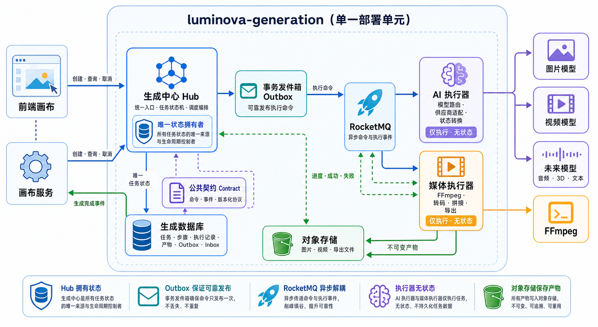
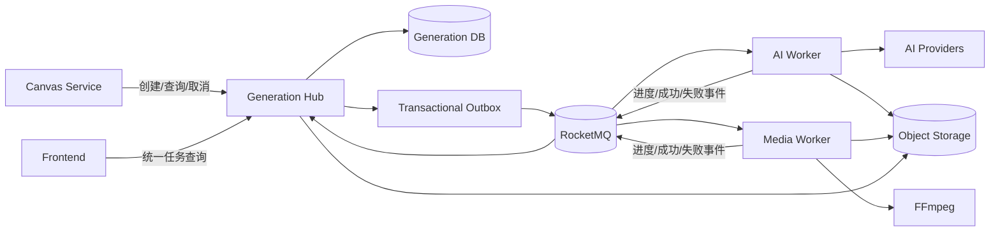
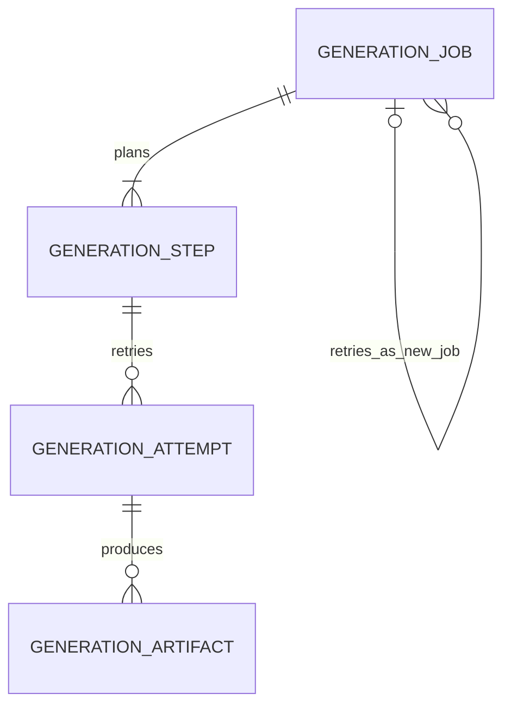

# PRD：Luminova 统一生成平台架构



后续待确定问题、讨论顺序和架构决策记录见：[生成平台架构讨论与决策日志](prd-generation-platform-decision-log.md)。

## 1. 文档状态

- 状态：架构讨论稿 V1
- 当前阶段：仅设计，不实施
- 架构策略：模块化单体起步，按负载与团队边界逐步拆分
- 通信策略：RocketMQ 异步消息
- 首期能力：AI 图片生成、AI 视频生成、FFmpeg 视频导出
- 工作流策略：首期以单任务为主，数据模型和协议预留多步骤编排能力

## 2. 背景与问题

Luminova 的画布会发起多种耗时任务：

- 调用第三方或自建 AI 模型生成图片；
- 调用 AI 模型生成视频；
- 使用 FFmpeg 拼接镜头、混合音轨、添加字幕并导出视频；
- 未来生成音频、文本、3D 内容或执行其他媒体处理任务。

这些任务具有共同特点：

- 执行时间长，不能占用同步 HTTP 请求；
- 外部模型可能采用同步返回、异步轮询或回调等不同协议；
- 任务可能失败、超时、重试、取消；
- 一个用户动作未来可能包含多个依赖步骤；
- 前端需要从一个稳定入口查询统一状态，而不应理解不同执行器的内部协议。

因此需要建立统一的生成平台，在保证首期开发成本可控的前提下，为未来扩展不同生成形式和独立部署做好边界设计。

## 3. 核心结论

### 3.1 不建议首期直接拆成多个网络微服务

“模型接入”“FFmpeg 执行”“状态聚合”具有清晰的逻辑边界，但首期不代表必须分别部署。

首期建议在 `luminova-generation` 微服务内部拆成 Maven 模块或严格包模块：

```text
luminova-generation
├── generation-contract       公共任务协议与事件
├── generation-hub            统一入口、任务状态、调度和编排
├── generation-ai             AI 模型适配器
├── generation-media          FFmpeg 等媒体执行器
└── generation-bootstrap      Spring Boot 启动与模块装配
```

模块之间只通过接口、命令和事件通信，不直接访问彼此的数据表。未来有独立扩容需求时，可将 `generation-ai` 或 `generation-media` 平滑拆成独立 Worker 服务。

### 3.2 统一入口应拥有任务状态的唯一真相

`generation-hub` 是任务状态的唯一权威来源：

- 创建任务；
- 生成任务 ID；
- 校验任务请求；
- 选择执行器；
- 发布执行命令；
- 消费执行事件；
- 更新统一状态；
- 对外提供查询、取消和重试接口；
- 未来负责多步骤工作流编排。

AI 和 FFmpeg 执行模块不能直接修改统一任务表，只能发布执行结果事件。

### 3.3 AI 模型与 FFmpeg 是执行器，不是任务中心

执行器只负责：

1. 接收标准执行命令；
2. 调用对应工具或供应商；
3. 上报进度、成功或失败事件；
4. 保证同一命令重复消费时不会重复产生不可控副作用。

执行器不负责：

- 决定画布业务状态；
- 向前端提供统一任务查询；
- 编排其他执行器；
- 保存全局任务生命周期。

### 3.4 导出也是生成平台中的任务

导出不应继续放在画布服务，也不必单独建立一个导出微服务。

它是生成平台中的一种任务：

```text
task_kind = EXPORT_VIDEO
executor_kind = MEDIA
```

导出结果作为不可变产物保存。画布后续发生修改，不影响旧导出记录。

## 4. 目标

- 为图片生成、视频生成和视频导出提供统一 API。
- 前端只理解一套任务状态和错误结构。
- 新增 AI 供应商时不修改任务中心核心逻辑。
- 新增 FFmpeg 操作或未来生成形式时可以增加执行器，而不修改画布模型。
- 所有异步消息支持幂等消费、重试和失败追踪。
- 保证任务状态最终一致且可以审计。
- 首期保持单个生成微服务部署，避免不必要的分布式复杂度。
- 为未来按 AI GPU 负载、CPU 媒体负载分别扩容做好准备。

## 5. 非目标

- 首期不实现通用低代码工作流设计器。
- 首期不允许用户自行编写任意 DAG。
- 首期不拆分多个独立数据库。
- 首期不支持跨地域任务调度。
- 首期不实现模型训练、微调和模型资产管理。
- 首期不实现复杂计费，但需要预留用量字段和事件。
- 首期不让执行器直接回调前端。

## 6. 推荐命名与模块职责

### 6.1 `generation-contract`

纯 Java 契约模块，不包含 Spring、数据库或具体供应商依赖。

包含：

- `GenerationCommand`
- `GenerationEvent`
- `TaskKind`
- `ExecutorKind`
- `TaskStatus`
- `ArtifactDescriptor`
- 错误码规范
- 消息版本号

该模块可以被 Hub、Worker 和未来独立微服务共同依赖。

### 6.2 `generation-hub`

中文定位：生成中心。

职责：

- 接收画布或前端创建任务的请求；
- 创建顶层任务和执行步骤；
- 根据任务类型选择执行器；
- 通过 Outbox 发布 RocketMQ 消息；
- 消费 Worker 事件并更新状态；
- 提供统一任务查询、取消和重试；
- 保存任务历史与产物引用；
- 未来实现受控的多步骤编排。

它不是简单的“状态聚合查询层”，而是生成领域的应用服务和状态机拥有者。

### 6.3 `generation-ai`

中文定位：AI 模型执行器。

内部使用适配器模式：

```text
AiModelExecutor
├── OpenAiImageAdapter
├── VolcengineVideoAdapter
├── KlingVideoAdapter
└── InternalModelAdapter
```

职责：

- 将标准请求转换为供应商请求；
- 提交任务；
- 处理同步返回、轮询和供应商回调；
- 将供应商状态转换为平台统一事件；
- 下载或转存生成产物；
- 记录供应商请求 ID、耗时和原始错误。

供应商密钥、限流、超时和模型映射属于本模块。

### 6.4 `generation-media`

中文定位：媒体处理执行器。

首期主要使用 FFmpeg，未来可以接入其他本地或云媒体工具。

职责：

- 视频拼接；
- 音视频混合；
- 字幕烧录；
- 转码、裁剪、缩放；
- 缩略图和封面提取；
- 输出最终导出文件；
- 上报可计算的处理进度。

FFmpeg 命令不能由外部请求直接传入，必须由受控参数构建，避免命令注入。

### 6.5 `generation-bootstrap`

负责 Spring Boot 启动、配置装配、消息订阅和模块组合。

首期上述模块打包为同一个部署单元：

```text
luminova-generation.jar
```

未来拆分时可增加：

```text
luminova-generation-hub.jar
luminova-generation-ai-worker.jar
luminova-generation-media-worker.jar
```

### 6.6 技术选型总览

选型原则：

1. 优先采用与现有 Spring Boot、Java 21、PostgreSQL、MyBatis-Plus 和 RocketMQ 技术栈兼容的组件；
2. 框架必须减少重复工程代码，不能取代清晰的领域边界；
3. 首期避免引入复杂工作流引擎和重量级状态机；
4. 所有第三方框架必须封装在基础设施层，领域模型不能依赖供应商 SDK；
5. 逻辑模块与独立部署微服务是两个决策，首期先保证模块边界。

推荐选型：

| 能力 | 推荐框架或方案 | 决策 |
|---|---|---|
| 模块边界 | Spring Modulith | 首期采用 |
| HTTP 契约 | OpenAPI 3.1 + OpenAPI Generator | 首期采用 |
| 参数校验 | Jakarta Bean Validation + JSON Schema Validator | 首期采用 |
| MQ 事件 | CloudEvents Java SDK | 首期采用 |
| MQ 契约 | AsyncAPI 3.0 | 首期采用 |
| 异步消息 | RocketMQ Spring Boot Starter | 首期采用 |
| 数据访问 | MyBatis-Plus + PostgreSQL | 沿用现有栈 |
| Outbox | 自研轻量 Outbox + `SKIP LOCKED` | 首期采用 |
| 多实例调度锁 | ShedLock | 条件采用 |
| 状态机 | 领域对象显式状态迁移 | 首期采用 |
| AI 接入 | 自定义 Provider Adapter + 可选 Spring AI | 条件采用 |
| HTTP 容错 | Resilience4j | 首期采用 |
| FFmpeg 接入 | Jaffree | 首期采用 |
| 对象存储 | 自定义 Storage Port + MinIO/S3/OSS Adapter | 首期采用 |
| 工作流编排 | Temporal | 后期评估 |
| 集成测试 | Testcontainers | 首期采用 |
| 监控追踪 | Actuator + Micrometer + OpenTelemetry | 首期采用 |

### 6.7 模块治理：Spring Modulith

Spring Modulith 用于保证单个部署单元内部的模块边界：

- 校验 Hub、AI、Media、Contract 等模块之间的依赖方向；
- 防止执行器直接访问 Hub 内部仓储；
- 编写模块级集成测试；
- 生成模块结构文档；
- 支持进程内领域事件。

建议的依赖方向：

```text
bootstrap
├── hub      → contract
├── ai       → contract
├── media    → contract
└── storage  → contract
```

禁止：

```text
ai    → hub.infrastructure
media → hub.infrastructure
hub   → 具体供应商 SDK
```

Spring Modulith 不能代替 RocketMQ 和 Transactional Outbox：

- Modulith 负责进程内模块边界与本地事件；
- RocketMQ 负责可拆分 Worker 的异步命令和事件；
- Outbox 负责数据库事务与消息发布之间的可靠衔接。

引入时必须选择与项目 Spring Boot `3.5.x` 兼容的 Spring Modulith 版本。

### 6.8 契约模块框架

`generation-contract` 推荐使用：

- OpenAPI Generator：生成 Java DTO、API 接口和 TypeScript 类型；
- Jakarta Bean Validation：校验已经反序列化的强类型 HTTP DTO；
- JSON Schema Validator：校验 MQ 消息、历史 JSONB 快照和动态协议；
- CloudEvents Java SDK：构造和解析标准执行事件；
- AsyncAPI：描述 RocketMQ Topic、生产者、消费者和消息 Schema。

JSON Schema Validator 建议采用支持 Draft 2020-12 的实现，例如 NetworkNT JSON Schema Validator。

职责分配：

| 工具 | 主要用途 |
|---|---|
| Bean Validation | HTTP 请求的常规字段校验 |
| JSON Schema Validator | 消息、快照和动态协议校验 |
| OpenAPI Generator | API DTO、接口和客户端骨架 |
| CloudEvents SDK | 标准事件信封 |
| AsyncAPI | MQ 契约文档和兼容性审查 |

不要求运行时对同一 HTTP DTO重复执行 Bean Validation 和 JSON Schema 校验。首期 HTTP 使用 Bean Validation，进入消息边界或处理历史快照时再使用 JSON Schema。

### 6.9 Hub 框架

`generation-hub` 沿用：

- Spring Boot；
- MyBatis-Plus；
- PostgreSQL；
- RocketMQ Spring Boot Starter。

RocketMQ 用于：

- 异步执行命令；
- Worker 进度和结果事件；
- 延迟轮询或延迟重试；
- 死信隔离。

Outbox 首期采用轻量自研方案：

```text
业务事务：
  写入 Job
  写入 Step
  写入 Outbox
提交

发布器：
  领取待发布 Outbox
  发布 RocketMQ
  标记发布成功
```

多实例并发领取建议使用 PostgreSQL：

```sql
FOR UPDATE SKIP LOCKED
```

如果发布扫描器需要定时调度，可使用 Spring Scheduler；存在多个调度实例争抢同一调度任务时再引入 ShedLock。

不要同时使用 RocketMQ 事务消息和数据库 Outbox 解决同一个一致性问题。首期以 Outbox 为唯一方案，便于审计、补偿和人工恢复。

### 6.10 状态机选型

首期不引入 Spring StateMachine。当前 Job 和 Step 状态较少，使用领域对象显式控制迁移更直观：

```java
public void start() {
    requireStatus(TaskStatus.QUEUED);
    status = TaskStatus.RUNNING;
}
```

同时集中定义允许迁移：

```java
Map<TaskStatus, Set<TaskStatus>> allowedTransitions;
```

必须具备：

- 非法迁移拒绝；
- 终态不可被迟到事件覆盖；
- 状态变更记录审计信息；
- 基于版本号的并发更新。

只有当状态包含大量守卫条件、并行状态和复杂动作时，才重新评估状态机框架。

### 6.11 AI 执行器框架

AI 接入的稳定边界必须是 Luminova 自定义接口：

```java
public interface GenerationProviderAdapter<I extends GenerationInput> {
    boolean supports(ModelRoute route);

    ProviderSubmission submit(I input);

    ProviderStatus query(String externalTaskId);

    CancelResult cancel(String externalTaskId);
}
```

Spring AI 可以作为部分 Adapter 的实现基础，但不能成为领域层接口。

适合使用 Spring AI 的能力：

- 已有稳定抽象覆盖的图片生成；
- Chat、Embedding、语音识别、TTS 和 Moderation；
- Spring AI 已原生支持的供应商。

仍需自定义 Adapter 的情况：

- AI 视频生成；
- 国内供应商特有的异步任务协议；
- 首尾帧、角色一致性等专属参数；
- 供应商回调、轮询和取消差异；
- Spring AI 尚未覆盖的模型类型。

推荐结构：

```text
GenerationProviderAdapter
├── SpringAiImageAdapter
├── KlingVideoAdapter
├── VolcengineVideoAdapter
└── InternalModelAdapter
```

供应商调用使用 Resilience4j 提供：

- Circuit Breaker；
- Rate Limiter；
- Bulkhead；
- Time Limiter；
- 少量瞬时故障重试。

必须区分：

- Resilience4j Retry：同一次 Attempt 内处理网络闪断、HTTP 502 等瞬时错误；
- Hub Attempt Retry：创建新 Attempt 的业务级重试。

两层重试次数必须统一配置上限，避免一次用户操作触发大量付费调用。

### 6.12 媒体执行器框架

`generation-media` 首期推荐 Jaffree 作为 FFmpeg/FFprobe Java 封装。

适用能力：

- 结构化构建 FFmpeg 命令；
- FFprobe 媒体信息探测；
- 进度监听；
- 异步执行；
- 优雅停止和强制停止；
- Filter Graph；
- 文件、管道或流式输入输出。

执行器仍必须自行负责：

- 输入素材下载；
- 每个 Attempt 的隔离临时目录；
- CPU、内存、磁盘和并发限制；
- 超时与取消；
- 输出上传对象存储；
- 临时文件清理；
- FFmpeg 退出码与截断日志持久化。

只有出现 Java 内部逐帧处理、OpenCV 分析或原生帧变换需求时，才评估 JavaCV。普通拼接、转码、字幕和音轨混合不引入 JavaCV。

### 6.13 对象存储框架

业务模块不能直接依赖 MinIO、S3 或云 OSS SDK。统一定义端口：

```java
public interface ArtifactStorage {
    StoredArtifact put(
            ArtifactKey key,
            InputStream content,
            ArtifactMetadata metadata
    );

    URI createDownloadUrl(ArtifactKey key, Duration ttl);
}
```

基础设施实现：

```text
ArtifactStorage
├── MinioArtifactStorage
├── S3ArtifactStorage
└── OssArtifactStorage
```

建议：

- 本地开发和集成测试使用 MinIO；
- 生产环境按部署云选择 OSS 或 S3；
- 数据库保存 Storage Key，不保存长期公开 URL；
- 下载时签发短期 URL。

### 6.14 工作流编排框架

首期不引入 Temporal，Job 通常只有一个 Step，多步骤能力仅在模型与协议中预留。

出现以下真实需求后再评估 Temporal：

- 工作流持续数小时或数天；
- 多步骤并行、条件分支和补偿；
- 服务重启后自动恢复执行位置；
- 人工等待或外部事件等待；
- 从指定失败步骤恢复；
- 工作流版本升级；
- 跨微服务的长事务编排。

典型触发场景：

```text
文生图
  → 图生视频
  → TTS
  → 字幕生成
  → FFmpeg 合成
```

Spring Batch 不适合远程异步媒体任务，它更适合数据库批处理和离线 ETL。

### 6.15 测试与可观察性框架

使用 Testcontainers 对以下组件做真实集成测试：

- PostgreSQL；
- RocketMQ；
- MinIO；
- 模拟供应商 HTTP 服务；
- 必要时包含安装了 FFmpeg 的测试容器。

重点测试：

- Outbox 发布失败后的恢复；
- RocketMQ 重复投递；
- Inbox 幂等；
- 迟到事件；
- Worker 重启；
- FFmpeg 取消和超时；
- 对象存储上传失败；
- 供应商回调重复到达。

可观察性采用：

- Spring Boot Actuator；
- Micrometer；
- OpenTelemetry。

日志、指标和 Trace 统一携带：

```text
job.id
step.id
attempt.id
message.id
task.kind
executor.kind
provider
model
```

### 6.16 暂缓引入清单

| 框架 | 暂缓原因 | 重新评估条件 |
|---|---|---|
| Temporal | 首期流程简单，引入成本较高 | 多步骤长流程成为核心能力 |
| Spring StateMachine | 当前状态有限，显式领域方法更清楚 | 状态和守卫条件显著复杂化 |
| Spring Batch | 不匹配远程异步媒体任务 | 出现大规模离线 ETL |
| JavaCV | 普通 FFmpeg 操作不需要逐帧 API | 需要 OpenCV 或逐帧处理 |
| Debezium Outbox | 首期基础设施与运维成本偏高 | Outbox 吞吐或 CDC 成为瓶颈 |

## 7. 总体架构



## 8. 领域模型修正

当前只有一张 `generation_task` 表，将请求、执行和结果全部放在一起。对于未来多执行器和多步骤任务，这个模型会变得模糊。

推荐拆成以下概念。

### 8.1 模型关系



四个概念的稳定定义：

| 对象 | 定义 | 用户是否直接可见 |
|---|---|---|
| Job | 一次不可变的用户生成意图 | 是 |
| Step | Hub 为完成 Job 规划的一个执行步骤 | 可展示摘要，不直接操作 |
| Attempt | Step 的一次真实派发和执行 | 通常仅运维可见 |
| Artifact | Attempt 成功产生并已进入平台存储的不可变产物 | 是 |

逻辑上 Job 拥有完整任务，但不把所有 Step、Attempt 和 Artifact 做成一个需要整体加载、整体保存的巨大聚合。进度事件和供应商回调频繁更新 Attempt，如果所有更新都争抢 Job 聚合，会造成热点行和不必要的并发冲突。

因此采用四个独立一致性边界：

```text
GenerationJob       聚合根
GenerationStep      聚合根
GenerationAttempt   聚合根
GenerationArtifact  聚合根
```

`generation-hub` 应用服务负责跨聚合协调。需要原子一致性的操作可以在同一个 Hub 数据库事务内更新多个聚合，但领域对象之间只通过 ID 引用，不持有可无限增长的对象集合。

本章确定对象职责、关联和不变量；Job、Step、Attempt 的精确状态枚举与迁移规则在状态机专题中确定。

### 8.2 Generation Job：一次用户意图

Job 表达用户的一次明确请求，例如：

- 为镜头生成一张图片；
- 为镜头生成一个视频；
- 将某个画布版本导出成片。

Job 是前端查询、取消和查看结果的主要对象。

建议属性：

| 属性 | 含义 |
|---|---|
| `id` | Job ID |
| `userId` | 发起用户 |
| `taskKind` | `IMAGE_GENERATION`、`VIDEO_GENERATION`、`VIDEO_EXPORT` |
| `subject` | 来源画布、节点及其版本 |
| `specVersion` | 创建 Job 时采用的任务协议版本 |
| `idempotencyKey` | 防止同一次提交被重复创建 |
| `inputSnapshot` | 已校验、不可变的任务输入快照 |
| `executionPolicy` | 超时、最大尝试次数、优先级和模型档位 |
| `retryOfJobId` | 用户手动重试或再次生成时指向前一个 Job，可空 |
| `rootJobId` | 一组用户重试链的首个 Job，可空或等于自身 |
| `status` | 面向用户的统一状态 |
| `progress` | 根据必要 Step 聚合出的进度 |
| `resultSummary` | 用户可见结果摘要，不保存完整产物内容 |
| `errorCode` | 稳定的平台错误码 |
| `errorMessage` | 用户可读错误信息 |
| `version` | 乐观锁版本 |
| `createdAt` | 创建时间 |
| `startedAt` | 首个必要 Step 开始时间 |
| `finishedAt` | Job 进入终态时间 |

Job 的不变量：

- 创建时必须包含合法的 `taskKind`、`subject`、协议版本和输入快照；
- 创建后 `taskKind`、`subject`、`specVersion`、`inputSnapshot` 不可修改；
- 一个 Job 至少规划一个必要 Step；
- Job 不能直接记录供应商任务 ID；
- Job 进度由必要 Step 聚合，不由 Worker 直接写入；
- Job 终态不重新打开；
- 取消 Job 由 Hub 转换为对未完成 Step 的取消请求。

必须保存完整输入快照和画布、节点版本。任务执行期间不能反复读取正在变化的画布内容。

### 8.3 Generation Step：一个可编排执行单元

Step 是 Hub 为完成 Job 创建的内部执行计划。

首期每个 Job 通常只有一个 Step：

```text
图片生成 Job → IMAGE_GENERATE Step
视频生成 Job → VIDEO_GENERATE Step
视频导出 Job → VIDEO_EXPORT Step
```

未来多步骤任务可以复用同一模型：

```text
成片 Job
├── STORYBOARD_IMAGE
├── VIDEO_GENERATE
├── TTS
└── VIDEO_EXPORT
```

建议属性：

| 属性 | 含义 |
|---|---|
| `id` | Step ID |
| `jobId` | 所属 Job |
| `stepKey` | Job 内稳定且唯一的步骤名 |
| `executorKind` | `AI`、`MEDIA` 或未来执行器类型 |
| `operation` | `IMAGE_GENERATE`、`VIDEO_GENERATE`、`VIDEO_EXPORT` 等 |
| `required` | 是否为 Job 成功所必需 |
| `status` | Step 状态 |
| `progress` | 当前步骤进度 |
| `inputSnapshot` | 派发给执行器的不可变输入 |
| `attemptCount` | 已创建的 Attempt 数量 |
| `maxAttempts` | 最大 Attempt 数量 |
| `nextRetryAt` | 允许自动重试的最早时间 |
| `outputSummary` | 步骤输出摘要及 Artifact ID |
| `errorCode` | 最终平台错误码 |
| `version` | 乐观锁版本 |
| `createdAt` | 创建时间 |
| `startedAt` | 首个 Attempt 开始时间 |
| `finishedAt` | Step 进入终态时间 |

步骤依赖不建议塞入单个 `dependsOn` 字段。未来支持多步骤时使用独立的 `StepDependency` 关系：

```text
upstreamStepId → downstreamStepId
```

Step 的不变量：

- `stepKey` 在同一个 Job 内唯一；
- `jobId`、`executorKind`、`operation` 创建后不可修改；
- 所有必要上游 Step 成功后才能派发；
- 同一 Step 同一时间最多只有一个活动 Attempt；
- `attemptCount` 不能超过 `maxAttempts`；
- 自动重试只能创建新的 Attempt，不能覆盖旧 Attempt；
- 输出型 Step 成功时至少存在一个可用 Artifact，除非该 Operation 明确定义为无产物操作。

### 8.4 Generation Attempt：一次真实执行

Attempt 表达 Step 的一次真实派发和执行。每次将命令交给 Worker，并由 Worker 调用供应商或启动 FFmpeg 进程，都对应一个 Attempt。

建议属性：

| 属性 | 含义 |
|---|---|
| `id` | Attempt ID |
| `jobId` | 冗余所属 Job，便于查询和审计 |
| `stepId` | 所属 Step |
| `attemptNo` | Step 内从 1 开始递增的序号 |
| `commandMessageId` | 本次派发命令的唯一消息 ID |
| `executorKind` | 实际执行器类型 |
| `provider` | AI 供应商或媒体执行引擎 |
| `modelName` | 实际模型名称，可空 |
| `externalTaskId` | 供应商异步任务 ID，可空 |
| `status` | 本次执行状态 |
| `progress` | 本次执行进度 |
| `requestPayload` | 实际发送给供应商或执行器的脱敏请求摘要 |
| `responsePayload` | 实际响应或执行结果摘要 |
| `errorCode` | 原始或规范化执行错误码 |
| `errorMessage` | 内部诊断错误信息 |
| `heartbeatAt` | Worker 最近一次心跳或进度时间 |
| `startedAt` | 开始执行时间 |
| `finishedAt` | 本次执行结束时间 |
| `version` | 乐观锁版本 |

Attempt 的不变量：

- `attemptNo` 在同一个 Step 内唯一且递增；
- `commandMessageId` 全局唯一，用于命令幂等；
- `stepId`、`attemptNo` 创建后不可修改；
- 一个 Attempt 只能绑定一个实际供应商任务或一个 FFmpeg 进程；
- Attempt 终态不可重新打开；
- 供应商回调、轮询结果和 MQ 重复事件必须幂等更新同一个 Attempt；
- 新一次供应商提交或 Worker 重新派发必须创建新 Attempt。

Resilience4j 在一次 Attempt 内只处理明确幂等的瞬时操作，例如查询状态或上传前的连接失败。对于“提交付费生成任务”这类无法确认是否已被供应商接受的请求，不允许盲目 HTTP 重试；必须通过供应商幂等键、外部任务查询或创建新 Attempt 处理。

### 8.5 Generation Artifact：不可变产物

Artifact 表示已经进入平台自有对象存储、可被追踪和复用的输出。

产物示例：

- 生成原图；
- 生成视频；
- 视频封面或缩略图；
- 音频；
- 字幕文件；
- 最终导出文件；
- 允许保留的中间媒体文件。

建议属性：

| 属性 | 含义 |
|---|---|
| `id` | Artifact ID |
| `jobId` | 来源 Job |
| `stepId` | 来源 Step |
| `attemptId` | 直接产生该产物的 Attempt |
| `artifactType` | `IMAGE`、`VIDEO`、`AUDIO`、`SUBTITLE` 等 |
| `artifactRole` | `PRIMARY`、`PREVIEW`、`THUMBNAIL`、`INTERMEDIATE` 等 |
| `storageKey` | 自有对象存储中的唯一 Key |
| `contentType` | MIME 类型 |
| `sizeBytes` | 文件大小 |
| `checksum` | 内容校验值 |
| `metadata` | 宽高、时长、编码、帧率等 |
| `visibility` | 用户可见、内部或隔离状态 |
| `createdAt` | 产物登记时间 |
| `deletedAt` | 延迟回收标记，可空 |

Artifact 的不变量：

- `storageKey` 全局唯一；
- 只有对象上传完成并校验成功后才能创建可用 Artifact；
- 文件内容、来源 Attempt、类型、校验和创建后不可修改；
- 一个 Attempt 可以产生多个 Artifact；
- 失败 Attempt 允许留下内部诊断或中间 Artifact，但默认不能作为用户结果；
- 数据库保存 Storage Key，不保存长期公开 URL；
- 删除采用延迟回收，不直接覆盖或复用原 Storage Key。

Artifact 是生成平台中的产物真相，但“某个画布节点当前选中了哪个产物”属于 Canvas 服务：

```text
Generation：保存所有历史 Artifact
Canvas：保存 currentArtifactId / sourceJobId / nodeVersion
```

当旧节点版本的任务迟到成功时，Artifact 仍然保留，但 Canvas 不应自动将它设为当前结果。用户可以在历史生成结果中主动选择。

### 8.6 重试语义

自动重试与用户手动重试必须区分：

| 场景 | 模型行为 |
|---|---|
| 网络或供应商临时故障，系统自动重试 | 原 Job、原 Step 下创建新 Attempt |
| 用户点击“重试”，输入完全不变 | 创建新 Job，并设置 `retryOfJobId` |
| 用户修改提示词后再次生成 | 创建新 Job，并设置 `retryOfJobId` 或来源链 |
| 用户要求从多步骤中的失败步骤恢复 | 首期不支持；未来创建新 Job 并引用原 Job 产物 |

选择“用户手动重试创建新 Job”的理由：

- Job 的用户意图和输入快照保持不可变；
- 已失败或已取消的 Job 不需要重新打开；
- 用户可以清晰比较每次生成；
- 成本、错误和产物归属更容易审计；
- 修改提示词与不修改提示词使用同一条简单规则。

### 8.7 聚合协调与事务边界

建议的关键事务：

创建任务：

```text
创建 Job
创建首批 Step
创建 Outbox Command
一次数据库事务提交
```

处理 Worker 事件：

```text
写入 Inbox
更新 Attempt
根据 Attempt 更新 Step
必要时登记 Artifact
根据必要 Step 聚合 Job
创建后续 Outbox Event/Command
一次数据库事务提交
```

这里允许 Hub 应用服务在同一数据库内协调多个聚合，因为它们属于同一个有界上下文。禁止 Worker 绕过 Hub 直接写这些表。

### 8.8 Outbox 与 Inbox

为避免“数据库任务已创建但消息未发出”，Hub 必须使用 Transactional Outbox：

1. 在同一数据库事务中写入 Job、Step 和 Outbox；
2. 后台发布器读取 Outbox；
3. 发布到 RocketMQ；
4. 成功后标记已发布。

Worker 使用 Inbox 或消费记录保证幂等：

- 同一个 `message_id` 重复到达时只产生一次业务效果；
- 供应商任务提交成功但确认消息丢失时，可以通过外部任务 ID 恢复；
- FFmpeg 重复命令不能覆盖其他任务输出目录。

## 9. 统一状态模型

Job 与 Step 统一使用：

| 状态 | 含义 |
|---|---|
| `QUEUED` | 已创建，等待调度 |
| `RUNNING` | 至少一个步骤正在执行 |
| `SUCCEEDED` | 所有必要步骤成功 |
| `FAILED` | 无法继续执行 |
| `CANCELLING` | 已请求取消，等待执行器确认 |
| `CANCELLED` | 已取消 |

不建议首期暴露过多供应商状态。供应商的 `SUBMITTED`、`PROCESSING`、`MODERATING` 等统一映射为 `RUNNING`，原始状态保存在 Attempt 中。

状态只能由事件驱动更新：

```text
TaskCreated
  → StepDispatched
  → StepStarted
  → StepProgressed
  → StepSucceeded / StepFailed / StepCancelled
  → JobSucceeded / JobFailed / JobCancelled
```

状态更新必须校验当前状态，拒绝倒退事件。例如已成功的步骤不能被迟到的“运行中”事件覆盖。

## 10. 统一任务协议

### 10.1 设计结论

目前没有一个成熟的行业标准能够直接统一 AI 生图、AI 视频、FFmpeg 导出以及未来音频、3D 等任务的全部业务参数。

不建议采用一个无限扩张的通用 JSON Map，也不建议直接使用 MCP 或 A2A 作为生成任务协议。推荐定义内部协议 `Luminova Generation Protocol v1`，组合使用以下成熟标准：

| 场景 | 采用标准 | 负责内容 |
|---|---|---|
| HTTP API | OpenAPI 3.1 | 创建、查询、取消和重试接口 |
| 任务参数 | JSON Schema 2020-12 | 不同任务输入的结构和校验 |
| MQ 事件 | CloudEvents 1.0 | 事件信封、来源、类型、时间和版本 |
| MQ 契约文档 | AsyncAPI 3.0 | RocketMQ Topic、消息方向和载荷 Schema |
| 未来复杂工作流 | 待评估 Serverless Workflow | 仅在系统预定义工作流不足时考虑 |

这些标准各司其职：

- OpenAPI 不负责定义消息队列行为；
- JSON Schema 不负责事件投递；
- CloudEvents 只统一事件信封，不定义生图和视频参数；
- AsyncAPI 描述消息接口，但不拥有任务状态；
- Luminova 只定义自身的任务类型、输入字段和状态语义。

### 10.2 统一外层信封

所有创建任务请求使用统一外层结构：

```json
{
  "specVersion": "luminova.generation/v1",
  "requestId": "req_193000000000000001",
  "idempotencyKey": "canvas-100-node-20-v12-generate-1",
  "taskKind": "VIDEO_GENERATION",
  "subject": {
    "canvasId": "100",
    "nodeId": "20",
    "canvasVersion": 12,
    "nodeVersion": 5
  },
  "input": {
    "prompt": "雨夜便利店，电影感侧光",
    "referenceArtifacts": [
      {
        "artifactId": "artifact_1001",
        "role": "FIRST_FRAME"
      }
    ],
    "durationMs": 6000,
    "aspectRatio": "16:9"
  },
  "execution": {
    "modelProfile": "cinematic-video",
    "priority": "NORMAL",
    "timeoutSeconds": 900,
    "maxAttempts": 2
  },
  "metadata": {
    "locale": "zh-CN"
  }
}
```

公共字段语义：

| 字段 | 必填 | 含义 |
|---|---|---|
| `specVersion` | 是 | Luminova 任务协议版本 |
| `requestId` | 是 | 单次请求追踪 ID，不作为业务幂等依据 |
| `idempotencyKey` | 是 | 防止客户端重试创建重复 Job |
| `taskKind` | 是 | 决定 `input` 的具体 Schema |
| `subject` | 是 | 任务来源以及画布、节点版本 |
| `input` | 是 | 具体任务的强类型参数 |
| `execution` | 否 | 优先级、超时、重试和模型路由偏好 |
| `metadata` | 否 | 不参与核心执行的扩展信息 |

`metadata` 不能用于承载执行器必需参数。凡是影响执行结果的字段，都必须进入对应的强类型 `input` 或 `execution`。

### 10.3 `taskKind + oneOf` 强类型输入

“统一接口”只意味着统一入口和公共信封，不意味着所有任务共用同一组业务字段。

OpenAPI 使用 `oneOf` 和 `discriminator` 根据 `taskKind` 选择具体 Schema：

```yaml
GenerationRequest:
  oneOf:
    - $ref: '#/components/schemas/ImageGenerationRequest'
    - $ref: '#/components/schemas/VideoGenerationRequest'
    - $ref: '#/components/schemas/VideoExportRequest'
  discriminator:
    propertyName: taskKind
    mapping:
      IMAGE_GENERATION: '#/components/schemas/ImageGenerationRequest'
      VIDEO_GENERATION: '#/components/schemas/VideoGenerationRequest'
      VIDEO_EXPORT: '#/components/schemas/VideoExportRequest'
```

首期任务类型：

| `taskKind` | 输入类型 | 执行器 |
|---|---|---|
| `IMAGE_GENERATION` | `ImageGenerationInput` | AI |
| `VIDEO_GENERATION` | `VideoGenerationInput` | AI |
| `VIDEO_EXPORT` | `VideoExportInput` | MEDIA |

Java 领域契约建议使用密封接口：

```java
public sealed interface GenerationInput
        permits ImageGenerationInput,
                VideoGenerationInput,
                VideoExportInput {
}
```

请求对象可以建模为：

```java
public record GenerationRequest<T extends GenerationInput>(
        String specVersion,
        String requestId,
        String idempotencyKey,
        TaskKind taskKind,
        GenerationSubject subject,
        T input,
        ExecutionOptions execution,
        Map<String, String> metadata
) {
}
```

禁止将核心输入建模为：

```java
Map<String, Object> input;
```

JSONB 可以作为数据库快照格式，但 API 和领域层必须保持强类型。写入快照前完成 Schema 校验，读取历史快照时根据 `specVersion + taskKind` 反序列化。

### 10.4 任务参数 Schema 示例

视频生成输入：

```json
{
  "$schema": "https://json-schema.org/draft/2020-12/schema",
  "$id": "https://luminova.local/schemas/generation/video-generation-input-v1.json",
  "type": "object",
  "required": ["prompt", "durationMs", "aspectRatio"],
  "properties": {
    "prompt": {
      "type": "string",
      "minLength": 1,
      "maxLength": 8000
    },
    "durationMs": {
      "type": "integer",
      "minimum": 1000,
      "maximum": 60000
    },
    "aspectRatio": {
      "enum": ["16:9", "9:16", "1:1"]
    },
    "referenceArtifacts": {
      "type": "array",
      "items": {
        "$ref": "artifact-reference-v1.json"
      }
    }
  },
  "additionalProperties": false
}
```

`additionalProperties: false` 用来阻止拼写错误或未声明参数悄悄进入执行流程。新增字段时需要升级 Schema，并遵守兼容性规则。

### 10.5 协议版本与兼容性

采用两层版本：

1. `specVersion`：整个任务信封版本，例如 `luminova.generation/v1`；
2. Schema 版本：具体任务输入和事件数据版本，例如 `video-generation-input-v1`。

兼容规则：

- 同一主版本内可以增加可选字段；
- 不得删除必填字段；
- 不得改变已有字段含义；
- 不得收窄已有枚举而不升级主版本；
- 字段重命名、类型变化和语义变化必须升级主版本；
- Hub 至少支持当前版本和上一个主版本的读取；
- 数据库快照永久保留原始 `specVersion`；
- Worker 不认识的版本必须拒绝执行并返回明确错误，不得猜测参数。

### 10.6 CloudEvents 事件信封

Worker 返回 Hub 的进度、成功、失败和取消结果使用 CloudEvents 1.0：

```json
{
  "specversion": "1.0",
  "id": "evt_193000000000000004",
  "source": "/luminova/generation/ai-worker",
  "type": "cn.luminova.generation.step.succeeded.v1",
  "subject": "jobs/193000000000000002/steps/193000000000000003",
  "time": "2026-06-24T14:01:00Z",
  "datacontenttype": "application/json",
  "dataschema": "https://luminova.local/schemas/events/step-succeeded-v1.json",
  "data": {
    "jobId": "193000000000000002",
    "stepId": "193000000000000003",
    "attemptNo": 1,
    "progress": 100,
    "artifacts": [
      {
        "artifactId": "artifact_2001",
        "type": "VIDEO",
        "storageKey": "generation/2026/06/video-001.mp4"
      }
    ]
  }
}
```

CloudEvents 字段职责：

- `id`：事件幂等 ID；
- `source`：事件产生者；
- `type`：稳定、版本化的事件类型；
- `subject`：对应 Job 和 Step；
- `time`：事件发生时间；
- `dataschema`：`data` 的 JSON Schema；
- `data`：Luminova 业务载荷。

建议事件类型：

```text
cn.luminova.generation.step.started.v1
cn.luminova.generation.step.progressed.v1
cn.luminova.generation.step.succeeded.v1
cn.luminova.generation.step.failed.v1
cn.luminova.generation.step.cancelled.v1
cn.luminova.generation.job.succeeded.v1
```

### 10.7 Command 与 Event 的区别

Hub 发给 Worker 的是命令，代表期望执行的动作；Worker 发回的是事实事件，代表已经发生的结果。

```text
命令：ExecuteVideoGeneration
事件：StepStarted / StepSucceeded / StepFailed
```

命令可以使用与 CloudEvents 相同的公共元数据风格，但必须在 AsyncAPI 中标明其语义是 Command，不应把命令伪装成已经发生的事件。

所有命令至少包含：

- `schemaVersion`
- `messageId`
- `jobId`
- `stepId`
- `attemptNo`
- `operation`
- `executorKind`
- `payload`
- `issuedAt`

### 10.8 AsyncAPI 契约

使用 AsyncAPI 3.0 描述：

- RocketMQ Topic；
- Producer 和 Consumer；
- Command 与 Event 方向；
- 消息头和载荷 Schema；
- Content Type；
- 消息示例；
- 版本兼容策略；
- 死信 Topic。

契约文件建议放置于：

```text
docs/contracts/generation-asyncapi.yaml
docs/contracts/openapi-generation.yaml
docs/contracts/schemas/
```

OpenAPI、AsyncAPI 和 JSON Schema 应进入版本控制，并在 CI 中执行语法校验和兼容性检查。

### 10.9 不采用的协议

- **MCP**：适合 LLM 与工具、资源之间的交互，不是媒体生成任务队列协议。
- **A2A**：适合智能体之间的任务协作，首期对 FFmpeg 和媒体任务过重。
- **仅使用 CloudEvents**：CloudEvents 不定义具体任务参数。
- **纯 JSONB Map**：缺乏编译期类型安全、Schema 校验和 SDK 生成能力。
- **供应商请求直接透传**：会让外部 API 与某个供应商永久耦合。

## 11. 消息设计

### 11.1 Topic 建议

首期可使用：

```text
generation.command.ai
generation.command.media
generation.event
generation.dead-letter
```

不要按每个供应商创建 Topic。供应商属于 AI Worker 内部路由。

### 11.2 Command 示例

```json
{
  "schemaVersion": "luminova.generation.command/v1",
  "messageId": "cmd_193000000000000001",
  "jobId": "193000000000000002",
  "stepId": "193000000000000003",
  "attemptNo": 1,
  "operation": "VIDEO_GENERATE",
  "executorKind": "AI",
  "payload": {
    "prompt": "雨夜便利店，电影感侧光",
    "model": "video-model-v1",
    "durationMs": 6000
  },
  "issuedAt": "2026-06-24T14:00:00Z"
}
```

### 11.3 Event 示例

Event 使用 CloudEvents 1.0，业务字段放入 `data`：

```json
{
  "specversion": "1.0",
  "id": "evt_193000000000000004",
  "source": "/luminova/generation/ai-worker",
  "type": "cn.luminova.generation.step.succeeded.v1",
  "subject": "jobs/193000000000000002/steps/193000000000000003",
  "time": "2026-06-24T14:01:00Z",
  "datacontenttype": "application/json",
  "dataschema": "https://luminova.local/schemas/events/step-succeeded-v1.json",
  "data": {
    "jobId": "193000000000000002",
    "stepId": "193000000000000003",
    "attemptNo": 1,
    "progress": 100,
    "artifacts": [
      {
        "type": "VIDEO",
        "storageKey": "generation/2026/06/video-001.mp4"
      }
    ]
  }
}
```

Command 必须包含：

- `schemaVersion`
- `messageId`
- `jobId`
- `stepId`
- `attemptNo`
- `issuedAt`

Event 必须符合 CloudEvents 1.0，并在 `data` 中包含 `jobId`、`stepId` 和 `attemptNo`。

## 12. AI 模型适配器设计

统一接口示意：

```java
public interface AiModelAdapter {
    boolean supports(ModelRoute route);

    SubmissionResult submit(AiExecutionRequest request);

    ExecutionStatus query(String externalTaskId);

    void cancel(String externalTaskId);
}
```

需要注意：

- 并非所有供应商都支持取消，接口结果要明确“已取消”或“不支持取消”；
- 并非所有供应商都支持进度百分比，不支持时只上报 `RUNNING`；
- 回调接口必须校验签名并支持重复回调；
- 轮询任务要使用延迟消息或调度器，不能在消费线程中阻塞等待；
- 供应商选择应由路由策略完成，不应写死在 Controller；
- 原始供应商响应需要脱敏，不能保存密钥和敏感请求头。

## 13. FFmpeg 执行器设计

FFmpeg Worker 与 AI Worker 的资源特征不同：

- AI Worker 主要等待远程网络任务；
- FFmpeg Worker 消耗本地 CPU、内存、磁盘和网络带宽。

因此即使首期同进程部署，也必须使用独立线程池和并发配额。

安全要求：

- 不接受外部传入的完整 shell 命令；
- 参数通过结构化对象生成；
- 输入文件只能来自受控对象存储；
- 每个 Attempt 使用独立临时目录；
- 输出文件名由系统生成；
- 设置执行超时、磁盘配额和最大输入文件大小；
- 无论成功失败都清理临时文件；
- 保存 FFmpeg 退出码和截断后的 stderr；
- 进程终止必须能响应取消请求。

## 14. API 边界

首期统一 API 建议：

```text
POST   /api/generation/jobs
GET    /api/generation/jobs/{jobId}
GET    /api/generation/jobs?canvasId={canvasId}
POST   /api/generation/jobs/{jobId}/cancel
POST   /api/generation/jobs/{jobId}/retry
GET    /api/generation/jobs/{jobId}/artifacts
```

创建任务请求不直接接受任意供应商参数，应按任务类型定义稳定 DTO。

示例：

```json
{
  "specVersion": "luminova.generation/v1",
  "requestId": "req_193000000000000003",
  "idempotencyKey": "canvas-193-node-193-version-12-generate-1",
  "taskKind": "VIDEO_GENERATION",
  "subject": {
    "canvasId": "193000000000000001",
    "nodeId": "193000000000000002",
    "canvasVersion": 12,
    "nodeVersion": 5
  },
  "input": {
    "prompt": "雨夜便利店",
    "durationMs": 6000,
    "aspectRatio": "16:9"
  },
  "execution": {
    "modelProfile": "cinematic-video",
    "priority": "NORMAL",
    "timeoutSeconds": 900,
    "maxAttempts": 2
  }
}
```

前端不应直接调用 AI Worker 或 Media Worker。

## 15. 与 Canvas 服务的边界

Canvas 服务负责：

- 画布、节点、边和版本；
- 用户编辑内容；
- 保存生成所需的提示词和参数；
- 将生成结果的 Artifact ID 或展示摘要关联到节点。

Generation 服务负责：

- 任务生命周期；
- 供应商调用；
- FFmpeg 执行；
- 重试、取消和超时；
- 产物元数据；
- 导出历史。

服务之间不建立数据库外键。

创建任务时由 Canvas 服务或网关提交不可变输入快照。Generation 服务不应在任务执行中反复查询 Canvas 当前数据。

完成后可以通过事件通知 Canvas：

```text
GenerationJobSucceeded
```

Canvas 消费后更新节点的当前产物引用。若用户已经修改节点并产生新版本，应根据 `canvasVersion/nodeVersion` 判断是否仍将该结果设为“当前结果”，但历史 Artifact 仍保留。

## 16. 用户故事

### US-001：统一创建生成任务

**描述：** 作为画布用户，我希望从同一个入口创建图片、视频或导出任务，以便获得一致的体验。

**验收标准：**

- [ ] 支持 `GENERATE_IMAGE`、`GENERATE_VIDEO`、`EXPORT_VIDEO`
- [ ] 创建接口立即返回 Job ID，不等待执行完成
- [ ] 重复 `idempotencyKey` 不创建重复 Job
- [ ] Job 和首个 Step 在同一事务中创建
- [ ] Outbox 记录在同一事务中创建

### US-002：查询统一任务状态

**描述：** 作为画布用户，我希望用同一个接口查看所有生成任务状态。

**验收标准：**

- [ ] 返回统一状态、进度、错误和产物
- [ ] 不暴露供应商内部状态给前端
- [ ] 支持按画布查询任务
- [ ] 迟到事件不能覆盖终态

### US-003：接入不同 AI 模型

**描述：** 作为开发者，我希望通过新增适配器接入模型，而不修改任务中心状态机。

**验收标准：**

- [ ] 适配器实现统一接口
- [ ] 支持同步结果、异步轮询和回调三种模式
- [ ] 供应商错误映射为平台错误码
- [ ] 供应商请求 ID 保存至 Attempt

### US-004：执行 FFmpeg 导出

**描述：** 作为用户，我希望将画布镜头导出为视频，并保留每次导出结果。

**验收标准：**

- [ ] 导出创建独立 Job
- [ ] 导出请求保存画布版本和输入快照
- [ ] 每次成功导出产生新的 Artifact
- [ ] 修改画布不会修改旧 Artifact
- [ ] FFmpeg 参数通过结构化配置构建

### US-005：失败重试

**描述：** 作为用户，我希望失败后能够重试，而不丢失原任务记录。

**验收标准：**

- [ ] 重试创建新的 Attempt
- [ ] 原 Attempt 保留
- [ ] 可区分可重试错误和不可重试错误
- [ ] 超过最大次数后 Job 进入 `FAILED`

### US-006：取消任务

**描述：** 作为用户，我希望取消尚未完成的任务，减少无效等待和成本。

**验收标准：**

- [ ] `QUEUED` 任务可以直接取消
- [ ] `RUNNING` 任务先进入 `CANCELLING`
- [ ] Worker 收到取消命令后尽力终止执行
- [ ] 不支持取消的供应商需要返回明确状态
- [ ] 已成功或失败任务不能取消

## 17. 功能需求

- FR-1：系统必须通过统一入口创建所有生成 Job。
- FR-2：创建 Job 必须支持幂等键。
- FR-3：Hub 必须是 Job 和 Step 状态的唯一写入者。
- FR-4：Worker 必须通过消息事件报告执行状态。
- FR-5：消息生产必须使用 Transactional Outbox。
- FR-6：消息消费必须支持 Inbox 或等效幂等机制。
- FR-7：每次真实执行必须产生独立 Attempt。
- FR-8：每个成功输出必须产生不可变 Artifact。
- FR-9：导出任务必须记录创建时的画布版本。
- FR-10：AI 供应商必须通过适配器接口接入。
- FR-11：FFmpeg 参数必须由受控结构生成。
- FR-12：任务必须支持超时、取消和有限次数重试。
- FR-13：所有消息契约必须包含版本号。
- FR-14：状态更新必须拒绝非法状态迁移。
- FR-15：执行器之间不能直接调用或编排彼此。
- FR-16：首期部署必须支持 AI 和 Media 独立线程池及并发配置。
- FR-17：HTTP API 必须使用 OpenAPI 3.1 描述。
- FR-18：不同任务输入必须使用 JSON Schema 2020-12 校验。
- FR-19：统一请求必须使用 `taskKind + oneOf/discriminator` 选择强类型输入。
- FR-20：执行事件必须使用 CloudEvents 1.0 信封。
- FR-21：RocketMQ 契约必须使用 AsyncAPI 3.0 描述。
- FR-22：所有持久化请求快照必须保存原始协议版本。
- FR-23：未知协议版本或未知字段必须产生明确校验错误，不得静默忽略。
- FR-24：任务 API 不得直接暴露或透传供应商专属请求对象。
- FR-25：首期必须使用 Spring Modulith 校验生成平台内部模块依赖。
- FR-26：AI 供应商必须通过 Luminova 自定义 Provider Adapter 接入。
- FR-27：供应商 HTTP 调用必须使用 Resilience4j 或等效机制实施限流、隔离、超时和熔断。
- FR-28：FFmpeg 命令必须通过 Jaffree 或等效结构化封装构建，不得接受外部完整命令。
- FR-29：对象存储必须通过 `ArtifactStorage` 端口访问，业务模块不得直接依赖具体厂商 SDK。
- FR-30：首期状态迁移必须由领域对象显式控制，不引入重量级状态机。
- FR-31：PostgreSQL、RocketMQ 和对象存储的关键路径必须有 Testcontainers 集成测试。
- FR-32：系统必须通过 Actuator、Micrometer 和 OpenTelemetry 暴露健康状态、指标和调用链。

## 18. 非功能需求

### 18.1 可靠性

- 服务重启后，未完成任务能够恢复；
- 消息至少投递一次，消费者必须幂等；
- 外部供应商超时不能无限占用线程；
- Outbox 消息可追踪未发布原因。

### 18.2 可观察性

日志和指标统一携带：

- `jobId`
- `stepId`
- `attemptId`
- `messageId`
- `provider`
- `model`

关键指标：

- 队列等待时长；
- 执行时长；
- 成功率；
- 重试率；
- 各供应商错误率；
- FFmpeg CPU、内存和磁盘使用；
- 未发布 Outbox 数量；
- 死信数量。

### 18.3 安全

- 供应商密钥不进入任务 JSON；
- 日志和数据库响应需要脱敏；
- 用户只能查询自己的任务或被授权画布的任务；
- 对象存储使用短期签名 URL；
- FFmpeg 禁止任意命令执行。

## 19. 分阶段路线

### Phase 0：架构确认

- 确认模块职责；
- 确认 Job/Step/Attempt/Artifact 模型；
- 确认 RocketMQ Topic 和消息契约；
- 确认 OpenAPI、AsyncAPI、CloudEvents 和 JSON Schema 组合方案；
- 确认首期任务类型及各自输入 Schema；
- 确认对象存储方案；
- 确认 Spring Modulith、Jaffree、Resilience4j 和 Testcontainers 版本兼容性；
- 不修改现有代码。

### Phase 1：模块化单体基础

- 将现有 `luminova-generation` 重组为五个模块；
- 建立 Job、Step、Attempt、Artifact、Outbox 表；
- 建立统一创建和查询 API；
- 建立协议契约目录和 CI 校验；
- 接入 RocketMQ；
- 引入 Spring Modulith 并建立模块依赖测试；
- 实现轻量 Outbox/Inbox；
- 建立 Actuator、Micrometer 和 OpenTelemetry 基础观测；
- 建立 PostgreSQL、RocketMQ 和 MinIO Testcontainers 测试环境；
- 实现一个 Mock AI Adapter；
- 验证端到端状态流转。

### Phase 2：首期真实能力

- 接入首个图片模型；
- 接入首个视频模型；
- 通过自定义 Provider Adapter 接入模型，并按需复用 Spring AI；
- 使用 Resilience4j 实现供应商调用保护；
- 使用 Jaffree 实现 FFmpeg 导出；
- 实现 `ArtifactStorage` 及 MinIO/生产存储适配器；
- 实现取消、重试、超时；
- 画布消费生成成功事件。

### Phase 3：工作流预留落地

- 支持系统预定义的多步骤模板；
- 支持步骤依赖；
- 支持失败补偿或从指定步骤重试；
- 不提供用户自定义 DAG UI。

### Phase 4：按需拆分部署

只有出现以下信号时才拆分：

- FFmpeg 需要独立 CPU 节点；
- AI Worker 需要独立网络、GPU或密钥隔离；
- 两类 Worker 扩缩容节奏明显不同；
- 单进程故障域不可接受；
- 团队已经分别负责不同执行器。

拆分后 Hub 数据库仍保持唯一任务真相，Worker 不共享 Hub 表。

## 20. 成功指标

- 所有生成形式通过同一 Job 查询接口返回状态。
- 新增供应商不修改 Hub 状态机。
- 重复消息不会产生重复 Artifact。
- 服务重启不会永久丢失已创建任务。
- 导出后修改画布，不影响历史导出产物。
- 首期可在不增加网络微服务数量的情况下独立限制 AI 和 FFmpeg 并发。
- 未来拆分 Worker 时不需要改变外部 API 和核心消息契约。
- 新增任务类型时只增加新的强类型 Input 和 Schema，不修改已有任务参数语义。
- OpenAPI 与 AsyncAPI 可以生成可用的接口文档或客户端骨架。

## 21. 风险与纠正建议

### 风险 1：将逻辑模块过早当作微服务

会增加部署、注册发现、链路追踪和一致性成本。首期应保持模块边界，延迟网络拆分。

### 风险 2：只有一张任务表

它无法清晰表达多步骤、重试和多个产物。应至少区分 Job、Step、Attempt、Artifact。

### 风险 3：统一入口只做查询聚合

如果多个执行器都能直接修改任务状态，会产生竞争和状态倒退。统一入口必须拥有状态机。

### 风险 4：执行任务读取实时画布

用户编辑会导致执行输入漂移。必须保存请求快照和画布版本。

### 风险 5：仅保存结果 URL

URL 会过期或供应商会清理文件。产物必须转存到自有对象存储并保存 Storage Key。

### 风险 6：把 MQ 当作状态数据库

MQ 负责传递，不负责长期状态。任务真相必须持久化在 Hub 数据库中。

### 风险 7：为了统一接口而使用无限扩张的 Map

会失去参数校验、IDE 提示和兼容性约束。统一公共信封，具体 `input` 必须保持强类型。

### 风险 8：直接采用供应商协议作为平台协议

会导致前端、画布和任务中心与供应商字段耦合。供应商协议只能存在于 Adapter 内部。

## 22. 待确认问题

以下问题留待下一轮架构评审：

1. 对象存储使用 MinIO、云 OSS，还是抽象接口同时支持？
2. 首个图片和视频模型供应商分别是谁？
3. 用户取消已产生供应商费用的任务时，产品如何提示？
4. 失败任务默认自动重试几次，哪些错误禁止重试？
5. 导出任务是否需要同时保存镜头清单和素材版本？
6. 前端状态更新采用轮询、SSE 还是 WebSocket？
7. 是否需要为任务预留用量、成本和计费字段？
8. RocketMQ 使用普通消息、延迟消息还是另建调度扫描器处理轮询？
9. 首期是否要求由 OpenAPI/AsyncAPI 自动生成 Java DTO，还是仅用于校验和文档？
10. 协议 Schema 使用独立仓库管理，还是与 `generation-contract` 模块一起版本化？
11. 本地与生产对象存储分别选择 MinIO、S3 还是云 OSS？
12. Spring AI 首期具体覆盖哪些模型，哪些供应商直接使用自定义 Adapter？
13. 是否需要首期就部署 OpenTelemetry Collector，还是先仅输出 OTLP？

## 23. 标准参考

- [OpenAPI Specification 3.1.1](https://spec.openapis.org/oas/v3.1.1.html)
- [JSON Schema Draft 2020-12](https://json-schema.org/draft/2020-12)
- [CloudEvents Specification](https://github.com/cloudevents/spec/blob/main/cloudevents/spec.md)
- [AsyncAPI Specification 3.0](https://www.asyncapi.com/docs/reference/specification/v3.0.0)
- [CNCF Serverless Workflow](https://serverlessworkflow.io/)
- [Spring Modulith Reference](https://docs.spring.io/spring-modulith/reference/)
- [Spring AI Reference](https://docs.spring.io/spring-ai/reference/)
- [RocketMQ Spring](https://github.com/apache/rocketmq-spring)
- [CloudEvents Java SDK](https://github.com/cloudevents/sdk-java)
- [NetworkNT JSON Schema Validator](https://github.com/networknt/json-schema-validator)
- [OpenAPI Generator](https://github.com/OpenAPITools/openapi-generator)
- [Resilience4j](https://resilience4j.readme.io/docs/getting-started-3)
- [Jaffree](https://github.com/kokorin/Jaffree)
- [ShedLock](https://github.com/lukas-krecan/ShedLock)
- [Testcontainers for Java](https://java.testcontainers.org/)
- [OpenTelemetry Java](https://opentelemetry.io/docs/languages/java/)
- [Temporal Java SDK](https://docs.temporal.io/develop/java)
